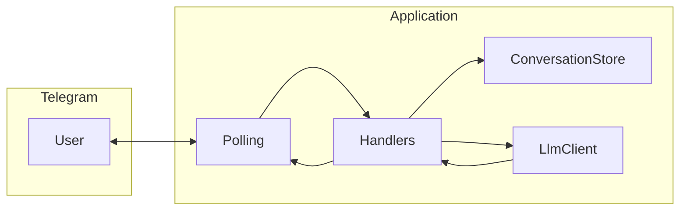

# Техническое видение проекта

Отправная точка и технический каркас для реализации идеи из [idea.md](idea.md). Цель — **максимально простой MVP** для проверки концепции: **KISS**, без оверинжиниринга.

---

## 1. Цель и границы MVP

**Цель:** Telegram-бот, ведущий текстовый диалог с пользователем и отвечающий через LLM, с ролью/поведением, заданными **системным промптом**.

**В scope MVP:**

- Один бот, один сценарий: входящее текстовое сообщение → ответ модели.
- История диалога **только в памяти процесса** (см. раздел 6): после перезапуска контекст обнуляется.
- Локальный запуск: без продакшен-деплоя и без VPS в описании.

**Вне scope MVP:**

- Базы данных и файловое сохранение истории.
- Webhook для Telegram (используется **long polling**).
- Сложная маршрутизация, плагины, очереди, отдельный API-сервер.

---

## 2. Технологии

| Область | Выбор | Примечание |
|--------|--------|------------|
| Язык | **Python 3.11** | Фиксированная версия для воспроизводимости. |
| Зависимости и окружение | **uv** | `pyproject.toml`, lock-файл, `uv sync` / `uv run`. |
| LLM | **Официальный `openai` (OpenAI Python SDK)** | Клиент совместим с OpenAI API; для OpenRouter задаётся `base_url` и ключ. |
| Провайдер LLM | **OpenRouter** | Единая точка доступа к моделям через совместимый API. |
| Telegram | **aiogram** (актуальная ветка 3.x) | Интеграция с Bot API; **polling** (long polling), без webhook. |
| Контейнеры | **Docker** + **Docker Compose** | Один сервис приложения; **volume под БД не используется** (история в памяти). |
| Сборка/запуск локально | **GNU Make** | Цели для `uv`, запуска бота, Docker. |
| Windows без Make | **PowerShell** | Скрипты или документированные команды, **дублирующие** цели Make. |
| Docker на Windows | **Docker через WSL** | Рекомендуется выполнять `docker compose` из среды, где доступен демон Docker (типично WSL2). |

Зависимости описываются в `pyproject.toml`; версии фиксируются средствами **uv** (lock).

---

## 3. Принципы разработки

- **KISS:** только то, что нужно для диалога и вызова LLM; без лишних слоёв и абстракций «на вырост».
- **ООП:** состояние и поведение выносятся в классы там, где это упрощает код.
- **Один класс — один файл:** каждый класс в отдельном модуле; не складывать несколько классов в один файл без веской причины.
- **Читаемость важнее «универсальности»:** проще явный поток обработки сообщения, чем тяжёлая инфраструктура.

---

## 4. Структура проекта (минимальная)

Ориентировочный каркас (имена можно слегка уточнить при реализации, логика — сохранить):

```text
.
├── docs/
│   ├── idea.md
│   └── vision.md
├── src/
│   └── <package_name>/
│       ├── __init__.py
│       ├── main.py              # точка входа: запуск polling
│       ├── config.py            # загрузка настроек из окружения
│       ├── logging_setup.py     # инициализация logging
│       ├── telegram_bot.py      # сборка Dispatcher/Router (или эквивалент aiogram)
│       ├── handlers/            # обработчики команд и сообщений (1 обработчик — по смыслу, без свалки)
│       ├── llm_client.py        # обёртка над OpenAI SDK для OpenRouter
│       └── conversation_store.py # in-memory хранилище истории по chat_id
├── pyproject.toml
├── uv.lock
├── Makefile
├── docker-compose.yml
├── Dockerfile
├── .env.example
└── scripts/                     # опционально: powerShell дубли команд
```

Пакет в `src/` изолирует код от корня репозитория; точное имя пакета задаётся при инициализации проекта.

---

## 5. Архитектура

**Поток данных:** Telegram (polling) → **Router/handlers** → чтение/обновление **in-memory истории** → **LLM-клиент** (OpenRouter) → ответ пользователю.



**Компоненты (логические):**

- **Polling + aiogram:** получение апдейтов, маршрутизация в handlers.
- **Handlers:** извлечь `chat_id` и текст, вызвать доменную логику «ответ на сообщение».
- **ConversationStore:** словарь `chat_id → список сообщений` (роли `user` / `assistant` в формате, ожидаемом API).
- **LlmClient:** формирование запроса к chat completions (system + history), обработка ответа и ошибок на верхнем уровне.

Связи — прямые вызовы Python; отдельная шина событий или микросервисы не вводятся.

---

## 6. Модель данных

**Персистентность:** отсутствует. **Никаких БД** и файлов для истории диалога.

**В памяти процесса:**

- Ключ — идентификатор чата Telegram (`chat_id`, целое).
- Значение — **список** элементов сообщения для API (например роль `user` / `assistant` и текст), либо структура, из которой перед вызовом LLM собирается список сообщений.

**Системный промпт:** не хранится в этой структуре как «сообщение пользователя»; текст загружается из файла, путь к которому задаётся **`SYSTEM_PROMPT_PATH`** (см. раздел 9), и передаётся в запросе к LLM как сообщение с ролью `system`.

**Ограничения MVP:** при росте числа чатов и длины истории возможен рост памяти; для проверки идеи допустимо **не вводить** усечение истории в первой версии или зафиксировать простой лимит (например последние N пар сообщений) в коде без конфигурируемых политик.

---

## 7. Работа с LLM

- **Библиотека:** `openai` (AsyncOpenAI при асинхронном aiogram).
- **Базовый URL:** задаётся обязательной переменной **`OPENROUTER_BASE_URL`** (см. раздел 9); в документации и `.env.example` указывают типичное значение `https://openrouter.ai/api/v1`.
- **Аутентификация:** ключ API OpenRouter в заголовке/параметрах, как требует совместимый с OpenAI клиент (обычно `api_key` + при необходимости дополнительные заголовки для OpenRouter — по актуальной документации OpenRouter).
- **Вызов:** chat completions с массивом сообщений: `system` (текст из файла по `SYSTEM_PROMPT_PATH`) + история из **ConversationStore** + новое пользовательское сообщение.
- **Модель:** имя модели задаётся конфигурацией (переменная окружения), без хардкода в бизнес-логике handlers.

Ошибки сети и ответов API: перехват на уровне **LlmClient** или handler; пользователю — короткое сообщение об ошибке без утечки секретов (см. раздел 10).

---

## 8. Сценарии работы

| Сценарий | Поведение |
|----------|-----------|
| **Старт** | Команда `/start` (или аналог): краткое приветствие; при желании — сброс истории для данного `chat_id` (явное правило зафиксировать в коде: сбрасывать или нет). |
| **Текстовое сообщение** | Добавить реплику пользователя в историю, вызвать LLM, добавить ответ ассистента в историю, отправить текст ответа в чат. |
| **Нетекстовые сообщения** | MVP: игнор или вежливый ответ «поддерживается только текст» — одно из двух, единообразно. |
| **Ошибка LLM** | Лог предупреждения/ошибки; пользователю — нейтральная фраза («сервис временно недоступен» и т.п.). |
| **Рестарт процесса** | История всех чатов в памяти теряется. |

---

## 9. Конфигурация

- **Источник:** переменные окружения; для локальной разработки — файл **`.env`** (в репозиторий только **`.env.example`** без секретов).
- **Подход:** минимальная загрузка в **одном модуле** (например `config.py`): чтение env, явная ошибка при старте, если не задана любая из обязательных переменных. Для отдельных некритичных параметров (например уровня логирования) допустимы значения по умолчанию в коде.
- **Обязательные переменные:** токен Telegram-бота; ключ API OpenRouter; идентификатор/имя модели; **`OPENROUTER_BASE_URL`** — базовый URL API (вызовы LLM не хардкодятся в коде); **`SYSTEM_PROMPT_PATH`** — путь к **файлу** с текстом системного промпта (содержимое читается при старте или при первом обращении; сам текст промпта в env не дублируем, только путь). В **`.env.example`** перечислить все обязательные имена и примеры значений (без секретов), для `OPENROUTER_BASE_URL` указать типичное значение `https://openrouter.ai/api/v1`.

Использование **pydantic-settings** допустимо, если оно уже тянется транзитивно или команда согласна на одну зависимость ради явной схемы; иначе — ручное чтение `os.environ` в духе KISS.

---

## 10. Логирование

- **Модуль:** стандартный **`logging`** Python.
- **Уровень по умолчанию:** `INFO` для продакшен-подобного локального запуска; `DEBUG` при отладке через переменную окружения.
- **Формат:** простой текстовый (время, уровень, логгер, сообщение); без обязательного JSON в MVP.
- **Запреты:** не логировать токены бота, ключи API, полные тела ответов с чувствительными данными. При логировании ошибок LLM — без сырого текста, содержащего секреты.

Вывод — в **stdout/stderr** (удобно для Docker `logs`).

---

## 11. Сборка и деплой

**Scope:** только **локальный** запуск и проверка в контейнере.

### Без Docker

- Установка зависимостей: `uv sync`.
- Запуск бота: `uv run python -m <package_name>` (или скрипт entry point из `pyproject.toml`).
- **Makefile:** цели в духе `install`, `run`, `lint` (если добавятся), `test` (если появятся) — по необходимости, без раздувания.
- **PowerShell:** те же действия документируются дублирующими командами или скриптом в `scripts/`, чтобы разработчик на Windows мог обойтись без Make.

### С Docker Compose

- **Dockerfile:** образ на базе Python 3.11, установка зависимостей через **uv** (кэш слоёв по возможности), команда запуска — тот же entry point, что и локально.
- **docker-compose.yml:** один сервис приложения, переменные окружения из `.env` или `env_file`, **без** томов для БД.
- На **Windows:** выполнять `docker compose` из **WSL** (или иной среды, где установлен Docker и демон доступен), согласованно с корпоративной/локальной политикой.

Публикация образа в реестр, CI/CD и удалённый сервер в документ **не входят** до отдельного решения.

---

## Сводка решений

| Тема | Решение |
|------|---------|
| История диалога | In-memory (`dict` / `list` по `chat_id`), без БД и файлов |
| Telegram | aiogram, **polling** |
| LLM | OpenAI SDK → **OpenRouter** |
| Окружение | Python **3.11**, **uv** |
| Контейнеры | **Docker Compose**, один сервис |
| Локальные команды | **Make** + **PowerShell** |
| Принципы | **KISS**, ООП, **1 класс = 1 файл** |
