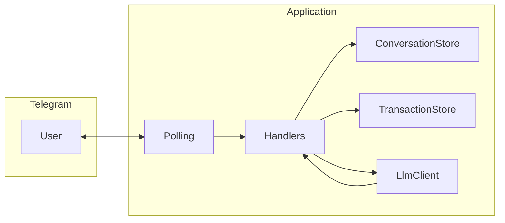

# Техническое видение проекта

Отправная точка и технический каркас для реализации идеи из [idea.md](idea.md). Цель — **простой MVP**: **KISS**, **YAGNI**, без оверинжиниринга.

---

## 1. Цель и границы MVP

**Цель:** Telegram-бот — **персональный финансовый советник**: учёт доходов и расходов из **текста**, **голосовых сообщений** и **фото чеков**, краткие ответы пользователю через LLM, **отчёт о балансе** по запросу.

**Продуктовое поведение:** задаётся **системным промптом** (файл по `SYSTEM_PROMPT_PATH`): тон, границы советов, как формулировать подтверждения и отчёты. Структура транзакций и извлечение полей — через **схему structured output**, а не свободный парсинг на regex.

**В scope MVP:**

- Один бот; состояние **только в памяти процесса**: история диалога и **таблица транзакций** по `chat_id`; после рестарта всё теряется.
- Текстовые сообщения с описанием трат/доходов; **голосовые** — ветка «**аудио в LLM**»: файл из Telegram передаётся в **мультимодальную** модель, поддерживающую вход аудио (транскрибация и извлечение на стороне модели **без** отдельного ASR-сервиса), далее тот же путь учёта, что для текста (**structured output**, **TransactionStore**); **фото** (чеки) — через **VLM**.
- Вызовы к LLM через **OpenAI Python SDK** к **OpenAI-совместимому** API (**OpenRouter** или **локальный Ollama** на GPU-сервере и т.п.) — переключение **только** через переменные окружения (см. раздел 9).
- Локальный запуск; без продакшен-VPS в описании.

**Вне scope MVP:**

- БД и файлы для истории и транзакций.
- Webhook (используется **long polling**).
- Очереди, отдельный API-сервер, многопользовательская аналитика, экспорт CSV/Excel.

---

## 2. Технологии

| Область | Выбор | Примечание |
|--------|--------|------------|
| Язык | **Python 3.11** | Фиксированная версия. |
| Окружение | **uv** | `pyproject.toml`, lock, `uv sync` / `uv run`. |
| LLM / VLM | **Официальный `openai` (AsyncOpenAI)** | Один клиент; `base_url` и ключи из env. |
| Провайдер | **OpenRouter и/или Ollama** | Оба через совместимый chat completions + vision там, где поддерживает модель. |
| Telegram | **aiogram 3.x** | **Polling**; без webhook. |
| Контейнеры | **Docker** + **Compose** | Один сервис приложения; томов под данные учёта нет. |
| Сборка | **GNU Make** + **PowerShell** | Дублирование целей на Windows по [idea.md](idea.md) / текущей практике репозитория. |

---

## 3. Принципы разработки

- **KISS / YAGNI:** один явный поток «апдейт → извлечение structured → запись в store → при необходимости ответ в чат»; без универсальных пайплайнов и плагинов.
- **ООП** там, где упрощает; **один класс — один файл** (имя модуля отражает назначение класса).
- **Читаемость:** проще дублировать похожий вызов LLM для текста и картинки, чем вводить абстрактный «провайдер извлечения».

---

## 4. Структура проекта (минимальная)

Каркас — прежний; добавляются модули под учёт и вызовы с structured output (имена при реализации могут чуть отличаться, смысл — сохранить):

```text
.
├── docs/
│   ├── idea.md
│   ├── vision.md
│   └── tasklist.md
├── src/
│   └── <package_name>/
│       ├── __init__.py
│       ├── main.py
│       ├── config.py
│       ├── logging_setup.py
│       ├── telegram_bot.py
│       ├── handlers/
│       ├── conversation_store.py
│       ├── transaction_store.py      # in-memory «таблица» транзакций по chat_id
│       ├── llm_client.py              # chat + structured output; VLM и мультимодальный вызов с аудио — здесь или отдельный thin-класс в отдельном файле только если разделение упростит чтение
│       └── ...                        # при необходимости: схемы Pydantic / JSON Schema для ответа модели — один небольшой модуль
├── pyproject.toml
├── uv.lock
├── Makefile
├── docker-compose.yml
├── Dockerfile
├── .env.example
└── make.ps1 (если есть)
```

**Правило:** если для VLM и текста достаточно методов в одном `LlmClient` — не плодить файлы; если файл раздувается, вынести **один** класс VLM-вызова в отдельный модуль.

---

## 5. Архитектура

**Поток (упрощённо):** Telegram (polling) → handlers → для **текста**: сообщение в историю + вызов LLM **с structured output** (транзакции + необязательный текст пользователю) → запись транзакций в **TransactionStore** → ответ в чат; для **голоса**: скачать файл → вызов **мультимодальной модели с аудио** (формат сообщения и MIME — как требует выбранный API; без отдельного STT) с **той же схемой извлечения**, что и для текста → **TransactionStore** + обновление **ConversationStore** по согласованному правилу (например, в историю попадает распознанный смысл или краткая служебная пометка — KISS) → ответ в чат; для **фото**: скачать файл → вызов **VLM** с изображением и той же (или согласованной) схемой извлечения → запись в **TransactionStore** → короткий ответ; для **отчёта**: чтение store + короткий LLM-ответ или детерминированная сводка — выбрать **простейший** вариант в итерации «отчёт» (без усложнения в MVP).



**Компоненты:**

- **ConversationStore** — как сейчас: история для контекста диалога.
- **TransactionStore** — по `chat_id`: список записей с полями из раздела 6.
- **LlmClient** — запросы chat completions: `system` + при необходимости история; для извлечения — **structured output**; для голосовых — передача **аудио** в сообщении пользователя в поддерживаемом API виде (**input_audio** или эквивалент провайдера); для изображений — **VLM** (поддержка API зависит от модели; при откате — явная фиксация в тасклисте).
- **Handlers** — маршрутизация: текст / голосовое / фото / команда отчёта. Прочие нетиповые сообщения — **единая** политика MVP (игнор или одна короткая фраза «не поддерживается» — как зафиксировано для стикеров/видео и т.д.).

---

## 6. Модель данных

**Персистентность:** нет. Всё **в памяти**.

### История диалога

- Ключ: `chat_id`.
- Значение: список сообщений для API (роли `user` / `assistant`), как в текущей реализации.
- Системный промпт в store **не** хранится; подставляется из файла по `SYSTEM_PROMPT_PATH`.

### Таблица транзакций (логическая)

Ключ: `chat_id`. Значение: список записей. **Одна запись** содержит:

| Поле | Смысл |
|------|--------|
| Дата | Дата операции (из сообщения/чека или дата получения сообщения — правило зафиксировать в промпте/коде минимально). |
| Время | Время операции (аналогично). |
| Направление | Доход или расход. |
| Сумма | Число; **валюта** — опционально: дефолт из env (например `DEFAULT_CURRENCY`) или встроено в описание, если в MVP одна валюта достаточно. |
| Тип операции | Повседневные / периодические / разовые (enum в схеме). |
| Категория | Например: продукты, рестораны, такси, образование, путешествия; допускается строка «другое» или свободная метка по ответу модели в рамках схемы. |
| Описание | Текст: товар, услуга, контрагент, источник дохода и т.д. |

**Ограничения MVP:** нет миграций схемы; при смене структуры — правка кода и промпта. Рост памяти при длинной истории транзакций допустим; при необходимости позже — простой лимит записей на чат.

---

## 7. Работа с LLM

### Общее

- Клиент: **`openai`** с **`base_url`** и **`api_key`** из конфигурации (см. раздел 9).
- **Structured output:** ответ модели должен маппиться на **фиксированную схему** (Pydantic-модель или `response_format`/JSON Schema — по возможностям выбранного backend и модели). Минимум: список распознанных транзакций + опционально **короткий текст** для пользователя (подтверждение, уточнение).
- **Текст пользователя:** один вызов с историей (по необходимости) и инструкцией извлечь транзакции из последней реплики (и при необходимости уточнить в ответе).
- **Фото чека:** отдельный вызов **VLM**: в сообщении пользователя — **image URL** или **base64** в формате, ожидаемом API. Та же или близкая схема транзакций; история диалога для чека **не обязательна** в MVP (достаточно системного промпта + изображения), если это упрощает.
- **Голосовое сообщение:** мультимодальный вызов с **входом аудио** (байты файла или data-URL/base64 по контракту API). Цель запроса — **распознать речь и извлечь транзакции** в той же **structured output**, что для текста (**один** вызов, если модель поддерживает; без отдельного шага «чистый STT-сервис»). История диалога для голоса — опционально (KISS: как для текста, если это не усложняет формат сообщения).

### Модели

- **Текст:** `LLM_MODEL`. **Vision:** `LLM_VISION_MODEL` (или фолбэк на `LLM_MODEL`), если текст и vision разведены провайдером.
- **Аудио (голос):** использовать **мультимодальную модель с поддержкой аудио в chat** (часто это та же `LLM_MODEL`, что поддерживает и текст, или отдельное имя в env). Если провайдер требует **отдельное имя** для audio-capable модели — ввести **опционально** переменную (например `LLM_AUDIO_MODEL`) с фолбэком на `LLM_MODEL`; зафиксировать в `.env.example` после реализации. Локальный Ollama / OpenRouter: совместимость **аудио + structured output** зависит от конкретной модели и версии API — проверять вручную по чеклисту итерации.

### Ошибки и логи

- Ошибки API — в **LlmClient** / handler; пользователю — коротко, без утечки ключей и без полного сырого текста с персональными финансовыми данными в логах.
- **Не логировать** полные тела запросов/ответов с суммами, содержимым чеков и **расшифровкой голосовых** на `INFO`; при отладке — при необходимости маскирование или `DEBUG` в локальной среде осознанно.

### Лимит ответа

- Сохраняется переменная **`LLM_MAX_COMPLETION_TOKENS`** (или эквивалент для совместимости с текущим кодом) для обычных ответов; для вызовов «только JSON / structured» лимит может быть меньше — по усмотрению в реализации без усложнения конфига (можно один общий лимит в MVP).

---

## 8. Сценарии работы

| Сценарий | Поведение |
|----------|-----------|
| **Старт** | `/start`: краткое приветствие в духе финансового советника (согласовано с системным промптом). По желанию — сброс истории и/или транзакций для `chat_id` (одно явное правило в коде). |
| **Текст: траты/доход** | Извлечение structured → добавление транзакций в **TransactionStore** → при необходимости обновление **ConversationStore** и текстовый ответ пользователю. |
| **Голос: траты/доход** | Скачивание голосового из Telegram → вызов LLM с **аудио** в сообщении → тот же **structured output**, что для текста → **TransactionStore**, **ConversationStore** и ответ по согласованному с текстом правилу. Если модель/endpoint не поддерживают аудио — короткое нейтральное сообщение пользователю (без сырого трейса). |
| **Фото чека** | Обработка как документ/фото Telegram (один формат на выбор в реализации); загрузка → VLM → запись транзакций → короткий ответ. Остальные нетиповые сообщения — **единая** политика MVP: игнор или одна фраза «не поддерживается». |
| **Отчёт / баланс** | Команда (например `/balance`) и/или распознавание запроса через тот же LLM с structured «намерение» — в итерации отчёта выбрать **один** простой способ (KISS). Показать агрегированный баланс (доходы − расходы) и при необходимости краткую разбивку по категориям из памяти без второго источника истины. |
| **Ошибка LLM** | Нейтральное сообщение пользователю; лог без чувствительных данных. |
| **Рестарт процесса** | История и транзакции теряются. |

---

## 9. Конфигурация

- Источник — **переменные окружения**; в репозиторий — **`.env.example`** без секретов.
- **Переключение OpenRouter ↔ Ollama:** только через **`.env`**, без смены кода. Меняются **`OPENROUTER_BASE_URL`**, **`LLM_MODEL`**, при необходимости **`LLM_VISION_MODEL`**, переменная **для голосовых** (если введена, см. раздел о моделях для аудио), **`OPENROUTER_API_KEY`**. Для Ollama: базовый URL вида `http://<хост>:11434/v1` (слэш перед `v1` обязателен); модели — как в `ollama list` (например текст `qwen2.5:7b-instruct`, vision `qwen3-vl:8b-instruct`). Имена переменных в коде исторически «openrouter», но **`base_url` любой OpenAI-совместимый** endpoint. **Не использовать** имена `OPENAI_*`, `MODEL_TEXT` / `MODEL_IMAGE` — приложение их не читает.
- **`OPENROUTER_API_KEY`:** для OpenRouter — реальный ключ. Для Ollama — **непустая заглушка** (например `ollama`): переменная **обязательна** при старте, сам Ollama ключ обычно не проверяет.
- Обязательные переменные расширяются **только по мере реализации** (например `LLM_VISION_MODEL` — обязательна, если в коде нет фолбэка); при старте — явная ошибка, если не хватает нужного набора.
- Остальное: `TELEGRAM_BOT_TOKEN`, `SYSTEM_PROMPT_PATH`, лимиты токенов — как в текущем проекте, с правками `.env.example` под новые поля.

---

## 10. Логирование

- Стандартный **`logging`**, текст в stdout/stderr.
- **Не** писать в лог ключи, токены, полные финансовые детали пользователя.

---

## 11. Сборка и деплой

Без изменений концепции: локально **uv**, **Make** / **PowerShell**, опционально **Docker Compose** одним сервисом; публикация и CI — вне MVP до отдельного решения.

---

## Сводка решений

| Тема | Решение |
|------|---------|
| Продукт | Финансовый советник + учёт доходов/расходов из текста, голосовых сообщений и чеков |
| Транзакции | In-memory по `chat_id`, без БД |
| Извлечение данных | LLM **structured output**; чеки — **VLM**; голос — **аудио в LLM** (мультимодальный запрос без отдельного ASR) |
| Провайдер | OpenAI SDK → **OpenRouter или Ollama** через `base_url` и модели из env |
| Telegram | aiogram, **polling** |
| Принципы | **KISS**, **YAGNI**, ООП, **1 класс = 1 файл** |
