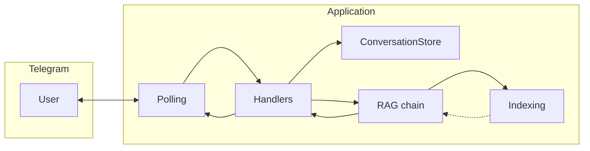

# Техническое видение проекта

Отправная точка для реализации [idea.md](idea.md). Цель — **рабочий RAG-диалог в Telegram** без лишней сложности: **KISS**, **YAGNI**, без оверинжиниринга.

---

## 1. Цель и границы

**Цель:** Telegram-бот на **aiogram** (async, **long polling**), который ведёт текстовый диалог и отвечает через **LangChain RAG**: перед поиском выполняется **трансформация запроса с учётом истории**, из ретривера берётся **топ-K** чанков, затем LLM формирует ответ по **истории и контексту**.

**Источники знаний (локально в репозитории):**

| Файл | Назначение |
|------|------------|
| `data/ouk_potrebitelskiy_kredit_lph.pdf` | документ по потребительскому кредиту |
| `data/usl_r_vkladov.pdf` | условия по вкладам |
| `data/sberbank_help_documents.json` | справочные тексты (JSON) |

**Векторное хранилище:** **`InMemoryVectorStore`** (LangChain). Персистентность индекса на диск **не требуется**: индекс пересобирается при необходимости (см. §8).

**История диалога:** только **в памяти процесса** по `chat_id`; после перезапуска контекст обнуляется. Формат сообщений для цепочек LangChain — **`HumanMessage` / `AIMessage` / `SystemMessage`** (`langchain_core.messages`), а не произвольные dict.

**Вне scope (пока не решено иначе):**

- Отдельная серверная БД для истории или для векторов.
- Webhook Telegram.
- Сложная маршрутизация, очереди, отдельный API-сервер только под RAG.

---

## 2. Референс пайплайна

Эталон логики RAG — ноутбук **`data/naive-rag.ipynb`**, финальная цепочка **`rag_query_transform_chain`**:

- ветка контекста: трансформация запроса по истории → **retriever** → форматирование чанков;
- затем промпт ответа с историей и контекстом → LLM → текст ответа.

Реализацию в коде бота нужно **воссоздать по смыслу** этой схемы (те же этапы), адаптировав загрузку документов под файлы из §1 и конфигурацию под §9.

---

## 3. Технологии

| Область | Выбор | Примечание |
|--------|--------|------------|
| Язык | **Python 3.11** | Воспроизводимость окружения. |
| Зависимости | **uv** | `pyproject.toml`, lock, `uv sync` / `uv run`. |
| RAG / оркестрация | **LangChain** (ядро + интеграции по необходимости: loaders, OpenAI-совместимый chat/embeddings) | Без лишних подпроектов «на вырост». |
| LLM и эмбеддинги | **OpenAI-совместимый API** через **`langchain_openai`** | Провайдер — **OpenRouter**: базовый URL — **`OPEN_BASE_URL`** (типичное значение `https://openrouter.ai/api/v1`). Ключ — **`OPEN_API_KEY`** (значение ключа OpenRouter). Имена моделей чата и эмбеддингов — из **`.env`** (см. §9). |
| Telegram | **aiogram 3.x**, async | **Polling** только. |
| Контейнеры | **Docker** + **Docker Compose** | Один сервис приложения; том под векторную БД не нужен. |
| Сборка локально | **GNU Make** | Цели для uv, run, Docker. |
| Windows без Make | **PowerShell** | Дублирование целей Make при необходимости. |

---

## 4. Принципы разработки

- **KISS / YAGNI:** один понятный поток «сообщение → история в messages → RAG-цепочка → ответ»; не вводить абстракции без явной пользы.
- **ООП** там, где упрощает поддержку; **один класс — один файл**, если не очевидный модуль-утилита без классов.
- **Читаемость** важнее «универсального движка»: явная сборка цепочки по образцу ноутбука предпочтительнее тяжёлой фабрики.

---

## 5. Структура проекта (ориентир)

Имена могут слегка отличаться; смысл сохранить:

```text
.
├── data/
│   ├── naive-rag.ipynb          # референс RAG
│   ├── *.pdf
│   └── sberbank_help_documents.json
├── docs/
│   ├── idea.md
│   ├── vision.md
│   └── tasklist.md
├── prompts/
│   └── system.txt               # системный промпт RAG-ассистента
├── src/
│   └── <package_name>/
│       ├── main.py
│       ├── config.py
│       ├── logging_setup.py
│       ├── telegram_bot.py
│       ├── handlers/
│       ├── conversation_store.py    # chat_id → список LangChain messages
│       ├── indexing.py              # загрузка, сплит, эмбеддинги, InMemoryVectorStore
│       └── rag_chain.py             # сборка цепочки по образцу naive-rag
├── pyproject.toml
├── uv.lock
├── Makefile
├── docker-compose.yml
├── Dockerfile
└── .env.example
```

Пакет в `src/` изолирует код от корня репозитория.

---

## 6. Архитектура потока



- **Indexing:** читает файлы из `data/` (перечень из §1), режет на чанки, строит **`InMemoryVectorStore`**.
- **ConversationStore:** `chat_id` → последовательность **`HumanMessage` / `AIMessage`** (и при необходимости системное сообщение не смешивается с пользовательской историей так же, как в принятом в коде дизайне — главное: вход цепочки в формате messages).
- **RAG chain:** query transformation (история → поисковая строка) → retriever **top-K** (`RETRIEVER_K`) → контекст → ответ LLM с историей.

Связи — прямые вызовы в процессе; отдельная шина событий не требуется.

---

## 7. Индексация и команды бота

| Команда / событие | Поведение |
|-------------------|-----------|
| **Старт приложения** | выполняется **полная переиндексация** (пересборка векторного хранилища из источников §1). |
| **`/index`** | явная **полная переиндексация** по запросу (тот же процесс, что при старте). |
| **`/index_status`** | ответ пользователю со **статусом индекса** — как минимум **число чанков** в хранилище (и при необходимости краткая пометка «готов» / ошибка последней сборки — по желанию, без усложнения). |

Ошибки индексации: логировать; пользователю при **`/index`** — нейтральное сообщение; при старте — падение с понятной ошибкой в логе или явный отказ стартовать (выбрать один стиль и зафиксировать в коде).

---

## 8. Диалог и RAG

1. Входящее текстовое сообщение добавляется в историю как **`HumanMessage`**.
2. Перед retrieval выполняется **query transformation** с подстановкой **всей релевантной истории** в промпт (как в `data/naive-rag.ipynb`).
3. Retriever возвращает **не более K** документов; **K = `RETRIEVER_K`** из **`.env`**.
4. LLM генерирует ответ с учётом **контекста (чанки)** и **истории**; ответ ассистента сохраняется как **`AIMessage`**.
5. Системный текст (`SystemMessage` или эквивалент в шаблоне промпта) задаёт роль и правила (опора на контекст, формулировки для пользователя); путь к файлу промпта — **`SYSTEM_PROMPT_PATH`**.

**Нетекстовые сообщения:** один согласованный вариант на весь проект — игнор или короткий ответ «поддерживается только текст» (как уже принято для MVP-бота).

---

## 9. Конфигурация

- Источник правды для секретов и параметров — **переменные окружения** и **`.env`** локально; в репозиторий — **`.env.example`** без секретов.
- При старте приложения — **явная ошибка**, если не заданы обязательные переменные (перечень поддерживать актуальным в `.env.example`).
- **LLM (OpenRouter через OpenAI-совместимый клиент):** **`OPEN_API_KEY`**, **`OPEN_BASE_URL`** (например `https://openrouter.ai/api/v1`), имена моделей для чата и для эмбеддингов — отдельными переменными (как в `.env.example`, без хардкода в handlers).
- **`RETRIEVER_K`** — целое число, топ-K для retriever (обязательно для RAG).
- **`SYSTEM_PROMPT_PATH`** — файл системного промпта.
- **`LLM_MAX_COMPLETION_TOKENS`** — лимит длины ответа чата (диапазон и имя поля API — как уже принято в проекте для chat completions).

Дополнительные переменные (прокси, `LOG_LEVEL`, токен Telegram и т.д.) — без изменения принципа «явная конфигурация, без секретов в логах».

---

## 10. Логирование

Стандартный **`logging`**: уровень из env, простой текст в stdout/stderr. **Не** логировать токены бота, ключи API, полные пользовательские тексты и большие дампы контекста без необходимости.

---

## 11. Сборка и локальный запуск

Как в текущем проекте: **`uv sync`**, **`uv run`** / Makefile, Docker Compose с одним сервисом, при необходимости дубли команд в PowerShell. Продакшен-деплой и CI в этом документе не фиксируются.

---

## Сводка решений

| Тема | Решение |
|------|---------|
| Знания | PDF + JSON в **`data/`**, перечень в §1 |
| Векторы | **`InMemoryVectorStore`**, без файлового persistence |
| Индексация | при **старте**, команда **`/index`**; статус — **`/index_status`** (число чанков) |
| Диалог | История — **LangChain messages**; **query transform** → **top-K** (`RETRIEVER_K`) → ответ |
| Референс | **`data/naive-rag.ipynb`** → **`rag_query_transform_chain`** |
| LLM-провайдер | **OpenRouter**, **`OPEN_BASE_URL`**, **`OPEN_API_KEY`**, модели из **`.env`** |
| Telegram | **aiogram**, async, **polling** |
| Принципы | **KISS**, **YAGNI** |
