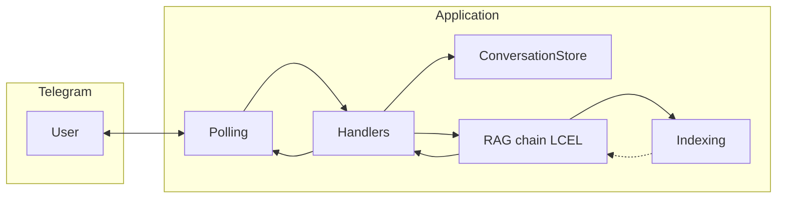

# Техническое видение проекта

Отправная точка для реализации [idea.md](idea.md). Цель — **рабочий RAG-диалог в Telegram** без лишней сложности: **KISS**, **YAGNI**, без оверинжиниринга.

---

## 1. Цель и границы

**Цель:** Telegram-бот на **aiogram** (async, **long polling**), который ведёт текстовый диалог и отвечает через **LangChain RAG** в стиле **LCEL**: перед поиском выполняется **трансформация запроса с учётом истории**, затем **retrieval** в одном из трёх режимов (см. ниже), после чего LLM формирует ответ по **истории и контексту** из отобранных чанков.

**Режимы retrieval (переключаются конфигурацией, без правки кода):**

| Режим | Смысл |
|--------|--------|
| **semantic** | только векторный поиск (**топ-K** из `InMemoryVectorStore`), как в базовом сценарии. |
| **hybrid** | **семантика + BM25** с объединением списков кандидатов (по смыслу **Part 1** в `data/advanced-hybrid-rag.ipynb`: `BM25Retriever` + семантический retriever + ensemble). |
| **hybrid_rerank** | гибрид, затем **cross-encoder reranking** кандидатов перед подстановкой в промпт (по смыслу **Part 2** той же тетрадки, `sentence_transformers.CrossEncoder`). |

**Источники знаний (локально в репозитории):**

| Файл | Назначение |
|------|------------|
| `data/ouk_potrebitelskiy_kredit_lph.pdf` | документ по потребительскому кредиту |
| `data/usl_r_vkladov.pdf` | условия по вкладам |
| `data/sberbank_help_documents.json` | справочные тексты (JSON) |

**Векторное хранилище:** **`InMemoryVectorStore`** (LangChain). Персистентность индекса на диск **не требуется**: индекс пересобирается при необходимости (см. §7).

**История диалога:** только **в памяти процесса** по `chat_id`; после перезапуска контекст обнуляется. Формат сообщений для цепочек LangChain — **`HumanMessage` / `AIMessage` / `SystemMessage`** (`langchain_core.messages`), а не произвольные dict.

**Мониторинг и качество:** при необходимости бот может **показывать источники** найденных фрагментов (файл, страницы); запросы **трейсятся в LangSmith** через переменные окружения (поддержка LangChain без обязательной доработки кода пайплайна). Для регрессий — **синтез локального датасета Q&A**, загрузка наборов в LangSmith и **оценка ответов метриками RAGAS** с отправкой результатов как feedback в LangSmith (§10).

**Вне scope (пока не решено иначе):**

- Отдельная серверная БД для истории или для векторов.
- Webhook Telegram.
- Сложная маршрутизация, очереди, отдельный API-сервер только под RAG.

---

## 2. Референсы пайплайна и Advanced RAG

**Базовый сценарий (история + трансформация запроса):** ноутбук **`data/naive-rag.ipynb`**, цепочка **`rag_query_transform_chain`**. В продуктовом коде этап **query transformation по истории переписки** сохраняется; финальная сборка — **Runnable / LCEL**, без отказа от этого этапа.

**Продвинутый retrieval:** ноутбук **`data/advanced-hybrid-rag.ipynb`**:

- **Part 1 — Hybrid RAG (Semantic + BM25):** семантический retriever поверх `InMemoryVectorStore`, **`BM25Retriever`** из **`rank-bm25`** (через **`langchain_community`**), объединение через **`EnsembleRetriever`** с настраиваемыми весами.
- **Part 2 — Cross-Encoder Reranking:** сужение/упорядочивание кандидатов моделью cross-encoder перед генерацией ответа.

Реализацию в коде бота нужно **воссоздать по смыслу** этих схем вместе с трансформацией запроса из naive-rag, адаптировав загрузку документов под файлы из §1 и конфигурацию под §9.

---

## 3. Технологии

| Область | Выбор | Примечание |
|--------|--------|------------|
| Язык | **Python 3.11** | Воспроизводимость окружения. |
| Зависимости | **uv** | `pyproject.toml`, lock, `uv sync` / `uv run`. |
| RAG / оркестрация | **LangChain** (ядро **LCEL**, `langchain_core`, интеграции) | Loaders, OpenAI-совместимый chat; **community** — BM25 и др. |
| Гибрид и реранкер | **`langchain-community`**, **`rank-bm25`**, **`sentence-transformers`** | BM25 + локальный cross-encoder; пути импорта — в духе референсной тетрадки. |
| Наблюдаемость датасетов | **LangSmith** (`LANGSMITH_*`), **`langsmith`**, **`datasets`**, **`ragas`** (≥ **0.2.0**) | Трейсинг через окружение. |
| LLM и эмбеддинги (опция API) | **OpenAI-совместимый API** через **`langchain_openai`** | Провайдер — **OpenRouter**: **`OPEN_BASE_URL`** (типично `https://openrouter.ai/api/v1`), ключ **`OPEN_API_KEY`**. Имена моделей — из **`.env`**. |
| Локальные эмбеддинги (опция HF) | **`sentence-transformers`** (+ обёртка LangChain для HuggingFace, как в тетрадке) | Выбор провайдера — конфиг (§9). |
| Telegram | **aiogram 3.x**, async | **Polling** только. |
| Контейнеры | **Docker** + **Docker Compose** | Один сервис приложения; том под векторную БД не нужен. |
| Сборка локально | **GNU Make** | Цели для uv, run, Docker. |
| Windows без Make | **PowerShell** | Дублирование целей Make при необходимости. |

---

## 4. Принципы разработки

- **KISS / YAGNI:** один понятный поток «сообщение → история в messages → query transform → retrieval (режим из конфига) → [опц. rerank] → ответ»; не вводить абстракции без явной пользы.
- **Модульность:** отдельные узлы или небольшие модули для построения retriever’ов, reranker’а и сборки LCEL-цепочки (без «универсального движка» на будущее).
- **ООП** там, где упрощает поддержку; **один класс — один файл**, если не очевидный модуль-утилита без классов.

---

## 5. Структура проекта (ориентир)

Имена могут слегка отличаться; смысл сохранить:

```text
.
├── data/
│   ├── naive-rag.ipynb
│   ├── advanced-hybrid-rag.ipynb   # референс гибрида и rerank
│   ├── rag-evaluation-practice.ipynb
│   ├── *.pdf
│   └── sberbank_help_documents.json
├── docs/
│   ├── idea.md
│   ├── vision.md
│   └── tasklist.md
├── prompts/
│   └── system.txt
├── src/
│   └── <package_name>/
│       ├── main.py
│       ├── config.py
│       ├── logging_setup.py
│       ├── telegram_bot.py
│       ├── handlers/
│       ├── conversation_store.py
│       ├── indexing.py              # эмбеддинги по выбранному провайдеру, InMemoryVectorStore, при необходимости список чанков для BM25
│       ├── rag_chain.py             # LCEL: query transform → retrieve → [rerank] → ответ + документы
│       ├── retrievers/              # опционально: semantic / hybrid / фабрика по режиму
│       ├── dataset_synthesizer.py
│       └── evaluation.py
├── datasets/
├── pyproject.toml
├── uv.lock
├── Makefile
├── docker-compose.yml
├── Dockerfile
└── .env.example
```

Каталог **`retrievers/`** — по необходимости; допустимо держать логику в `indexing.py` / `rag_chain.py`, если объём остаётся небольшим (**YAGNI**).

---

## 6. Архитектура потока



- **Indexing:** читает файлы из `data/` (перечень из §1), режет на чанки, строит **`InMemoryVectorStore`** и при необходимости **тот же набор `Document` для BM25** (общий список чанков в памяти — допустимое **KISS**-решение).
- **ConversationStore:** `chat_id` → последовательность **`HumanMessage` / `AIMessage`**.
- **RAG chain:** **query transformation** (история → поисковая строка, по смыслу naive-rag) → **retrieval** в режиме из конфига → при **`hybrid_rerank`** — **cross-encoder rerank** → контекст → ответ LLM с историей. Цепочка возвращает **текст ответа и документы с метаданными** для **`SHOW_SOURCES`**.

---

## 7. Индексация и команды бота

| Команда / событие | Поведение |
|-------------------|-----------|
| **Старт приложения** | **полная переиндексация** (векторное хранилище и данные, необходимые для BM25, согласованы с текущими чанками). |
| **`/index`** | явная **полная переиндексация**. |
| **`/index_status`** | статус индекса — как минимум **число чанков** (и при необходимости краткая пометка о готовности / ошибке последней сборки). |
| **`/evaluate_dataset`** | полный цикл **RAGAS** (§10); параметры LLM и embeddings для RAGAS — из env. |

Ошибки индексации: логировать; пользователю при **`/index`** — нейтральное сообщение; при старте — падение с понятной ошибкой или явный отказ стартовать (единый стиль в коде).

---

## 8. Диалог и RAG

1. Входящее текстовое сообщение добавляется в историю как **`HumanMessage`**.
2. Перед retrieval выполняется **query transformation** с подстановкой **всей релевантной истории** в промпт (как в **`data/naive-rag.ipynb`**, `rag_query_transform_chain`).
3. **Retrieval** зависит от **`RAG_RETRIEVAL_MODE`**: только семантика, **hybrid** (вектор + BM25 + ensemble), или **hybrid_rerank** (то же + cross-encoder). Лимиты **`K`** для семантики и BM25, веса ensemble и параметры rerank — **раздельно в конфиге** (§9); итоговое число чанков в промпте — **не больше заданного финального K** (или эквивалентное имя в `.env.example`).
4. LLM генерирует ответ с учётом **контекста** и **истории**; ответ сохраняется как **`AIMessage`**.
5. Системный текст — **`SYSTEM_PROMPT_PATH`**.

**Нетекстовые сообщения:** один согласованный вариант на весь проект — игнор или короткое сообщение о поддержке только текста.

---

## 9. Конфигурация

- Источник правды — **переменные окружения** и **`.env`**; в репозиторий — **`.env.example`** без секретов.
- При старте — **явная ошибка**, если не заданы обязательные переменные (перечень поддерживать актуальным в `.env.example`).

**Общее:**

- **`OPEN_API_KEY`**, **`OPEN_BASE_URL`** — OpenAI-совместимый API (**OpenRouter**).
- Имя **чат-модели** — отдельная переменная (как уже принято в проекте, например chat-модель для диалога и RAG).
- **`SYSTEM_PROMPT_PATH`**, **`LLM_MAX_COMPLETION_TOKENS`**, **`RETRIEVER_K`** или согласованный набор **`K`** (см. ниже).
- **`SHOW_SOURCES`**, **`LANGSMITH_*`**.

**Режим и провайдеры embeddings:**

- **`RAG_RETRIEVAL_MODE`**: `semantic` | `hybrid` | `hybrid_rerank`.
- **`EMBEDDING_PROVIDER`**: `openai` | `huggingface` — от этого зависят клиент индексации и имя модели (API-модель vs HF repo id).
- Имя модели эмбеддингов для основного пайплайна — **`EMBEDDING_MODEL`** (или раздельные имена, если так проще явно развести провайдеры в `.env.example`; **KISS**: одна пара provider + model, если достаточно).

**Раздельные настройки retrieval (ориентир имён — зафиксировать в `.env.example`):**

- Семантика: **`SEMANTIC_K`** (или переиспользование **`RETRIEVER_K`** при полном совпадении смысла в режиме только semantic).
- BM25: **`BM25_K`**.
- Гибрид: веса **`HYBRID_SEMANTIC_WEIGHT`**, **`HYBRID_BM25_WEIGHT`** (сумма 1.0) для `EnsembleRetriever`.
- Реранкер: **`CROSS_ENCODER_MODEL`** (идентификатор модели для `CrossEncoder`), **`RERANK_CANDIDATE_POOL`** (сколько кандидатов забирать до rerank), **`RERANK_TOP_K`** (сколько документов после rerank отдавать в LLM; согласовать с финальным контекстом).

**RAGAS:**

- **`RAGAS_LLM_MODEL`** — модель для метрик, требующих LLM.
- **`RAGAS_EMBEDDING_PROVIDER`**, **`RAGAS_EMBEDDING_MODEL`** — провайдер и модель эмбеддингов для RAGAS **независимо или совместно с основным пайплайном**, по выбору в конфиге (допустимо на старте совпадение с основным — проще **KISS**).

Прочие переменные (прокси, `LOG_LEVEL`, токен Telegram) — без нарушения принципа «явная конфигурация, без секретов в логах».

---

## 10. Мониторинг, синтез датасетов и RAGAS

1. **Источники в ответе:** **`SHOW_SOURCES`**; цепочка возвращает **ответ + retrieved (после rerank, если включён)** документы.
2. **LangSmith:** корректные **`LANGSMITH_*`**; отдельный код трейсинга в цепочке **не обязателен**, если LangChain покрывает сценарий.
3. **Синтез датасета:** без изменения смысла прежнего плана: **`dataset_synthesizer.py`**, **`datasets/SBERAGENTS_RAG_EVALUATION_DATASET_V1.json`**, **`make dataset`**, **`make dataset-upload`**.
4. **Оценка (`evaluation.py`):** **`/evaluate_dataset`**, метрики **faithfulness**, **answer_relevancy**, **answer_correctness**, **answer_similarity**, **context_recall**, **context_precision**; **feedback в LangSmith**. Эмбеддинги и LLM для RAGAS — из §9; ориентир по сценарию — **`data/rag-evaluation-practice.ipynb`**.

При смене провайдера embeddings оценка должна оставаться **воспроизводимой** при заданных env.

---

## 11. Логирование

Стандартный **`logging`**: уровень из env, вывод в stdout/stderr. **Не** логировать токены, ключи API, полные тексты пользователя и большие дампы контекста без необходимости.

---

## 12. Сборка и локальный запуск

**`uv sync`**, **`uv run`** / Makefile, Docker Compose с одним сервисом. Цели **`dataset`** и **`dataset-upload`**. Продакшен-деплой и CI здесь не фиксируются.

---

## Сводка решений

| Тема | Решение |
|------|---------|
| Знания | PDF + JSON в **`data/`**, перечень в §1 |
| Векторы | **`InMemoryVectorStore`**, без файлового persistence |
| Индексация | **старт**, **`/index`**, **`/index_status`** |
| Диалог | **LangChain messages**; **query transform**; режимы **semantic / hybrid / hybrid_rerank** |
| Гибрид | **BM25** + семантика + **`EnsembleRetriever`** (тетрадка Part 1) |
| Реранк | **Cross-encoder** (`sentence-transformers`), тетрадка Part 2 |
| Embeddings | Провайдер **`openai` \| `huggingface`** + модели из env |
| Источники в UI | **`SHOW_SOURCES`**, ответ + документы |
| Трейсинг | **LangSmith**, **`LANGSMITH_*`** |
| Датасет / RAGAS | Как §10; **`RAGAS_EMBEDDING_PROVIDER`**, **`RAGAS_EMBEDDING_MODEL`** |
| Референсы | **`data/naive-rag.ipynb`**, **`data/advanced-hybrid-rag.ipynb`**, **`data/rag-evaluation-practice.ipynb`** |
| LLM | **OpenRouter**, **`OPEN_BASE_URL`**, **`OPEN_API_KEY`**, модели из **`.env`** |
| Зависимости RAG advanced | **`sentence-transformers`**, **`langchain-community`**, **`rank-bm25`** |
| Telegram | **aiogram**, async, **polling** |
| Принципы | **KISS**, **YAGNI** |
