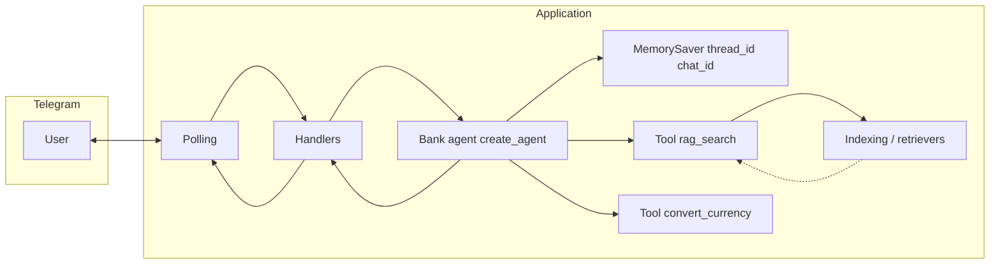

# Техническое видение проекта

Отправная точка для реализации [idea.md](idea.md). Цель — **рабочий диалог в Telegram** с **ReAct-агентом**, **RAG-инструментом** и при необходимости **ориентировочной конвертацией валют** без лишней сложности: **KISS**, **YAGNI**, без оверинжиниринга.

---

## 1. Цель и границы

**Цель:** Telegram-бот на **aiogram** (async, **long polling**), который ведёт текстовый диалог. Ответы формирует **LangChain 1.0**-агент, собранный через **`create_agent()`** с **checkpointer** **`MemorySaver`**. Инструменты домена: **`rag_search`** — обёртка над существующим retrieval (режим из конфига), которую модель вызывает, когда нужны факты из документов; **`convert_currency`** — пересчёт суммы между валютами по публичному ориентировочному курсу (не курс банка), без ключей API в базовой конфигурации. **OpenRouter** (OpenAI-совместимый API) — провайдер чат-модели.

**Режимы retrieval (переключаются конфигурацией, без правки кода):** выбираются переменной **`RAG_RETRIEVAL_MODE`** — те же три значения, что и ранее:

| Режим | Смысл |
|--------|--------|
| **semantic** | только векторный поиск (**топ-K** из `InMemoryVectorStore`). |
| **hybrid** | **семантика + BM25** (`EnsembleRetriever` и веса из env). |
| **hybrid_rerank** | гибрид, затем **cross-encoder reranking** перед отдачей результатов из инструмента. |

Инструмент **`rag_search`** не дублирует отдельный «query transformation»-узел LCEL: **поисковую строку формирует агент** в аргументах вызова (и при необходимости может вызывать инструмент несколько раз с разными запросами).

**Источники знаний (локально в репозитории):**

| Файл | Назначение |
|------|------------|
| `data/ouk_potrebitelskiy_kredit_lph.pdf` | документ по потребительскому кредиту |
| `data/usl_r_vkladov.pdf` | условия по вкладам |
| `data/sberbank_help_documents.json` | справочные тексты (JSON) |

**Векторное хранилище:** **`InMemoryVectorStore`**. Персистентность индекса на диск **не требуется**: индекс пересобирается при необходимости (см. §7).

**История диалога:** в **checkpointer** агента по **`thread_id`**, согласованному с **`chat_id`** Telegram (в процессе; после перезапуска — поведение `MemorySaver` как раньше у in-memory хранилища). Сообщения — **`langchain_core.messages`** (`HumanMessage`, `AIMessage`, `ToolMessage`, …).

**Мониторинг и качество:** **`SHOW_SOURCES`**; трейсинг **LangSmith** через **`LANGSMITH_*`**. Синтез датасета и **RAGAS** — §10; при оценке каждый прогон изолировать **уникальным `thread_id` / `chat_id`**, чтобы история в `MemorySaver` не смешивала примеры.

**Вне scope (пока не решено иначе):**

- Отдельная серверная БД для истории или для векторов.
- Webhook Telegram.
- Инструменты помимо **`rag_search`** и **`convert_currency`** (веб-поиск, действия в банковских системах и т.п.) без явного расширения idea/vision.
- Отдельный API-сервер только под RAG.

---

## 2. Референсы пайплайна и Advanced RAG

**Агент и инструмент (обёртка, описание, `create_agent`):** ноутбук **`data/agent.ipynb`**, раздел **II — LangChain 1.0 `create_agent`** (паттерн ReAct, список tools, high-level API).

**Retrieval (гибрид, rerank), индексация, чанки:** **`data/advanced-hybrid-rag.ipynb`** (Part 1 — hybrid, Part 2 — rerank). Загрузка и нарезка документов — согласованы с файлами из §1.

**Устаревший для точки входа продуктовый поток «query transform → LCEL цепочка → ответ»** заменён агентом; идеи **naive-rag** могут использоваться локально как ориентир по промптам и данным, но **не** как обязательная архитектура ответа.

---

## 3. Технологии

| Область | Выбор | Примечание |
|--------|--------|------------|
| Язык | **Python 3.11** | Воспроизводимость окружения. |
| Зависимости | **uv** | `pyproject.toml`, lock, `uv sync` / `uv run`. |
| Агент и RAG | **LangChain 1.x** | **`create_agent`**, инструменты, **checkpointer `MemorySaver`**. Ядро: `langchain_core`, совместимые интеграции. |
| Гибрид и реранкер | **`langchain-community`**, **`rank-bm25`**, **`sentence-transformers`** | BM25 + cross-encoder — по референсной тетрадке. |
| Наблюдаемость датасетов | **LangSmith**, **`datasets`**, **`ragas`** (≥ **0.2.0**) | Трейсинг через окружение. |
| LLM и эмбеддинги (опция API) | **OpenAI-совместимый API** через **`langchain_openai`** | Провайдер — **OpenRouter**: **`OPEN_BASE_URL`** (типично `https://openrouter.ai/api/v1`), **`OPEN_API_KEY`**. Имена моделей — из **`.env`**. |
| Локальные эмбеддинги (опция HF) | **`sentence-transformers`** (+ обёртка LangChain для HuggingFace) | Выбор — конфиг (§9). |
| Telegram | **aiogram 3.x**, async | **Polling** только. |
| Контейнеры | **Docker** + **Docker Compose** | Один сервис приложения; том под векторную БД не нужен. |
| Сборка локально | **GNU Make** | Цели для uv, run, Docker. |
| Windows без Make | **PowerShell** | Дублирование целей Make при необходимости. |

---

## 4. Принципы разработки

- **KISS / YAGNI:** один понятный поток «сообщение → история в агенте → при необходимости `rag_search` и/или `convert_currency` → финальный текст»; общая логика построения retriever/rerank — переиспользуется инструментом и оценкой, без абстрактного «движка агентов».
- **Модульность:** отдельные модули для retriever factory, описания **`rag_search`** и **`convert_currency`**, сборки агента (`create_agent`), при необходимости тонкий слой между Telegram и `agent.stream`.

---

## 5. Структура проекта (ориентир)

Имена могут слегка отличаться; смысл сохранить:

```text
.
├── data/
│   ├── naive-rag.ipynb
│   ├── advanced-hybrid-rag.ipynb
│   ├── rag-evaluation-practice.ipynb
│   ├── agent.ipynb                 # референс create_agent и tool
│   ├── *.pdf
│   └── sberbank_help_documents.json
├── docs/
│   ├── idea.md
│   ├── vision.md
│   └── tasklist.md
├── prompts/
│   └── system.txt                  # системный промпт (роль банка; rag_search; convert_currency; few-shot)
├── src/
│   └── <package_name>/
│       ├── main.py
│       ├── config.py
│       ├── logging_setup.py
│       ├── telegram_bot.py
│       ├── handlers/
│       ├── indexing.py             # эмбеддинги, InMemoryVectorStore, чанки для BM25
│       ├── rag_chain.py             # переиспользуемые части retrieval / фабрика (или переименование по факту)
│       ├── retrievers/              # опционально
│       ├── tools/                   # rag_search, convert_currency (LangChain @tool)
│       ├── bank_agent.py           # или agent.py: create_agent + MemorySaver
│       ├── dataset_synthesizer.py
│       └── evaluation.py
├── datasets/
├── pyproject.toml
├── uv.lock
├── Makefile
├── docker-compose.yml
├── Dockerfile
└── .env.example
```

**YAGNI:** не плодить каталоги; если файл один — допустимо держать tool рядом с агентом до роста кода.

---

## 6. Архитектура потока



- **Indexing:** как ранее — чанки, вектора, BM25-пул при необходимости.
- **Агент:** `create_agent(model, tools=[rag_search, convert_currency, …], system_prompt=…, checkpointer=MemorySaver())`.
- **`rag_search`:** принимает поисковую строку (и при необходимости минимальный набор параметров, зафиксированный в описании инструмента — без раздувания); внутри — вызов retriever для **`RAG_RETRIEVAL_MODE`**; результат — см. §8 и контракт ниже.
- **`convert_currency`:** аргументы — сумма и коды валют **ISO 4217**; источник курсов — публичный HTTP API без ключей в `.env`; ответ пользователю всегда с оговоркой, что курс ориентировочный и не является курсом банка. Контракт возврата — JSON в §8.

---

## 7. Индексация и команды бота

| Команда / событие | Поведение |
|-------------------|-----------|
| **Старт приложения** | полная переиндексация |
| **`/index`** | явная полная переиндексация |
| **`/index_status`** | статус — как минимум **число чанков** |
| **`/evaluate_dataset`** | полный цикл **RAGAS** (§10) |

Ошибки индексации — логировать; пользователю при **`/index`** — нейтральное сообщение; при старте — единый стиль с понятной ошибкой.

---

## 8. Диалог, инструменты `rag_search` и `convert_currency`, ответ пользователю

1. Входящее сообщение добавляется в состояние агента как **`HumanMessage`** (через `agent`/`Runnable` invoke API — как принято для `create_agent` + checkpointer).

2. **Получение ответа:** использовать **`bank_agent.stream(..., stream_mode="values")`** (или эквивалентное имя графа). Реализовать **функцию логирования шагов** (например итерации/ReAct-состояние без утечки секретов). При **`AIMessage` без текста и без `tool_calls`** — **warning** в лог. **Обязательный fallback** для пользователя при пустом/неконсистентном финальном ответе (короткое нейтральное сообщение).

3. **`rag_search` — контракт возврата:** строка JSON с **`ensure_ascii=False`**. Структура:

```json
{
  "sources": [
    {
      "source": "<имя файла>",
      "page_content": "<полный текст чанка>",
      "page": <номер страницы для PDF или null для безстраничных источников>
    }
  ]
}
```

Полный **`page_content`** обязателен для корректных **контекстов RAGAS** (§10). Имя ключа **`source`** — файл-источник; **`page`** — только когда метаданные PDF дают номер страницы.

4. **`convert_currency` — контракт возврата:** строка JSON с **`ensure_ascii=False`**. При успехе: **`ok`** = **`true`**, поля **`from_currency`**, **`to_currency`** (ISO 4217), **`amount`**, **`rate`** (курс «за единицу исходной валюты» к целевой), **`result`** (произведение), текстовое поле **`note`** с напоминанием, что курс ориентировочный и не является курсом банка. При ошибке: **`ok`** = **`false`**, **`error`** — краткая причина. Данный инструмент **не** участвует в **`SHOW_SOURCES`** и не поставляет контекст для RAGAS.

5. **`SHOW_SOURCES`:** из **текущего** пользовательского запроса собрать документы **только из сообщений после последнего `HumanMessage`** в истории: все **`ToolMessage`**, порождённые вызовами **`rag_search`** (не **`convert_currency`**), распарсить и объединить в перечень для отображения (без дублирования по смыслу — по желанию, KISS: достаточно стабильного списка).

6. Системный промпт — **`SYSTEM_PROMPT_PATH`**: роль банковского ассистента, **жёсткие правила**, **когда** вызывать **`rag_search`** и **`convert_currency`**, **few-shot** примеров по обоим и подсказки по формулировке поисковых запросов к `rag_search`.

**Нетекстовые сообщения:** один согласованный вариант на весь проект — игнор или короткое сообщение о поддержке только текста.

---

## 9. Конфигурация

Источник правды — **переменные окружения** и **`.env`**; пример без секретов — **`.env.example`**. При старте — явная ошибка при отсутствии обязательных переменных.

Общее: **`OPEN_API_KEY`**, **`OPEN_BASE_URL`**, модель чата, **`SYSTEM_PROMPT_PATH`**, **`SHOW_SOURCES`**, **`LANGSMITH_*`**.

**Retrieval:** **`RAG_RETRIEVAL_MODE`**: `semantic` | `hybrid` | `hybrid_rerank`. **`EMBEDDING_PROVIDER`**, **`EMBEDDING_MODEL`**, **`SEMANTIC_K`** / **`BM25_K`** / **`HYBRID_*_WEIGHT`** / **`RERANK_*`** / **`CROSS_ENCODER_MODEL`** — как в действующей схеме (имена сохранять согласованными с `.env.example`).

**RAGAS:** **`RAGAS_LLM_MODEL`**, опционально **`RAGAS_LLM_MAX_COMPLETION_TOKENS`** (иначе как у основного чата), **`RAGAS_EMBEDDING_PROVIDER`**, **`RAGAS_EMBEDDING_MODEL`**.

Подробные перечни имён переменных не дублировать здесь сверх необходимости — поддерживать актуальность в **`.env.example`**.

---

## 10. Мониторинг, синтез датасетов и RAGAS

1. **Источники в ответе и оценке:** приложение сохраняет в результатах ответа **перечень документов из `rag_search`**, использованных для формирования ответа в текущем ходе; вызовы **`convert_currency`** в этот перечень **не** включаются, чтобы **`SHOW_SOURCES`** и **RAGAS** опирались на одну и ту же семантику «контекст из документов банка».

2. **LangSmith:** корректные **`LANGSMITH_*`**.

3. **Синтез датасета:** **`dataset_synthesizer.py`**, **`datasets/`**, **`make dataset`**, **`make dataset-upload`**; имя набора в LangSmith и имя файла JSON по умолчанию задаются **`LANGSMITH_DATASET`** (см. `.env.example`; синоним **`LANGSMITH_DATASET_NAME`**).

4. **Оценка (`evaluation.py`):** **`evaluate_dataset`** — **полностью async**. Внутри целевой callable — **`async def target(...)`**. Использование LangSmith **`aevaluate`**: сначала **`experiment_results = await client.aevaluate(...)`**, затем **`async for result in experiment_results`**. Для RAGAS **contexts** — списки **`page_content`** из извлечённых документов (ответа агента и вызовов **`rag_search`**). На **каждый** элемент датасета / каждый вызов оценки назначать **уникальный `thread_id`** (или эквивалент для конфига памяти), чтобы **`MemorySaver`** не смешивал историю между примерами. Метрики и feedback — как ранее (**faithfulness**, **answer_relevancy**, **answer_correctness**, **answer_similarity**, **context_recall**, **context_precision**), ориентир — **`data/rag-evaluation-practice.ipynb`** с учётом агентской точки входа.

---

## 11. Логирование

Стандартный **`logging`**: уровень из env. **Не** логировать токены, ключи API, полные тексты пользователя и огромные JSON инструментов без необходимости.

---

## 12. Сборка и локальный запуск

**`uv sync`**, **`uv run`** / Makefile, Docker Compose с одним сервисом. Цели **`dataset`** и **`dataset-upload`**.

---

## Сводка решений

| Тема | Решение |
|------|---------|
| Знания | PDF + JSON в **`data/`**, перечень в §1 |
| Векторы | **`InMemoryVectorStore`**, без файлового persistence |
| Индексация | старт, **`/index`**, **`/index_status`** |
| Диалог | **ReAct**, **`create_agent`**, **`MemorySaver`**, **`thread_id` ↔ `chat_id`** |
| RAG в продукте | Инструмент **`rag_search`**; режимы **semantic / hybrid / hybrid_rerank** из конфига |
| Валюты (ДЗ‑7) | Инструмент **`convert_currency`**; публичный курс без env-ключа; см. §8; вне **`SHOW_SOURCES`** и контекста RAGAS |
| Контракт rag_search | JSON **`{"sources": [...]}`**, **`ensure_ascii=False`**, полный **`page_content`**, **`page`** для PDF |
| Контракт convert_currency | JSON успех/`error`, поля суммы и курса §8 |
| Запросы к поиску | Формулирует **LLM-агент**; отдельный LCEL **query transformation** для retrieval **не** используется |
| Ответ в Telegram | **`stream_mode="values"`**, лог шагов, **warning** без tool_calls, **fallback** |
| Источники | После последнего **`HumanMessage`** — все **`ToolMessage(rag_search)`** |
| Гибрид / реранк | По **`data/advanced-hybrid-rag.ipynb`** |
| Агент / tool API | По **`data/agent.ipynb`** (раздел **`create_agent`**) |
| Embeddings | Провайдер **`openai` \| `huggingface`** + модели из env |
| Трейсинг | **LangSmith** |
| RAGAS | Async **`aevaluate`**, уникальный **`thread_id`**, контексты из **`page_content`** |
| LLM | **OpenRouter**, **`OPEN_BASE_URL`**, **`OPEN_API_KEY`** |
| Telegram | **aiogram**, async, **polling** |
| Принципы | **KISS**, **YAGNI** |
