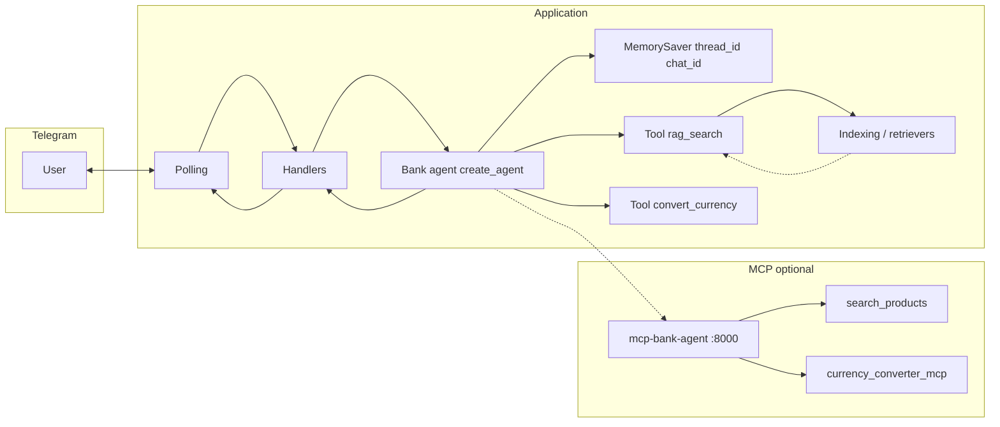

# Техническое видение проекта

Отправная точка для реализации [idea.md](idea.md). Цель — **рабочий диалог в Telegram** с **ReAct-агентом**, **RAG-инструментом** и при необходимости **ориентировочной конвертацией валют** без лишней сложности: **KISS**, **YAGNI**, без оверинжиниринга.

---

## 1. Цель и границы

**Цель:** Telegram-бот на **aiogram** (async, **long polling**), который ведёт текстовый диалог. Ответы формирует **LangChain 1.0**-агент, собранный через **`create_agent()`** с **checkpointer** **`MemorySaver`**. **Базовые** инструменты домена (всегда в составе агента): **`rag_search`** — обёртка над существующим retrieval (режим из конфига), когда нужны факты из PDF/JSON в корневом **`data/`**; **`convert_currency`** — пересчёт между валютами по согласованному публичному API **без отдельного MCP** (ориентировочный курс, не курс банка). **Опционально** (при запущенном MCP-сервере): инструменты **`search_products`** и **`currency_converter_mcp`** с подпроекта **`mcp/mcp-bank-agent`** подключаются через **`langchain-mcp-adapters`** и **`MultiServerMCPClient`**: **`search_products`** — простой поиск по **`mcp/mcp-bank-agent/data/bank_products.json`** (типы продуктов, названия, описания, условия, акции и типовые параметры), когда нужной динамики нет в проиндексированных файлах; **`currency_converter_mcp`** — универсальная конвертация **любой валюты в любую** через **RUB** по данным **[cbr-xml-daily.ru](https://www.cbr-xml-daily.ru/)** (JSON над курсами ЦБ РФ), для **актуального** на дату сервиса курса. Если MCP недоступен — **warning** в лог и агент работает только с **`rag_search`** и **`convert_currency`** (**graceful degradation**). **OpenRouter** — провайдер чат-модели.

**Режимы retrieval (переключаются конфигурацией, без правки кода):** выбираются переменной **`RAG_RETRIEVAL_MODE`** — те же три значения, что и ранее:

| Режим | Смысл |
|--------|--------|
| **semantic** | только векторный поиск (**топ-K** из `InMemoryVectorStore`). |
| **hybrid** | **семантика + BM25** (`EnsembleRetriever` и веса из env). |
| **hybrid_rerank** | гибрид, затем **cross-encoder reranking** перед отдачей результатов из инструмента. |

Инструмент **`rag_search`** не дублирует отдельный «query transformation»-узел LCEL: **поисковую строку формирует агент** в аргументах вызова (и при необходимости может вызывать инструмент несколько раз с разными запросами).

**Источники знаний (локально в репозитории):**

| Файл | Назначение |
|------|------------|
| `data/ouk_potrebitelskiy_kredit_lph.pdf` | документ по потребительскому кредиту |
| `data/usl_r_vkladov.pdf` | условия по вкладам |
| `data/sberbank_help_documents.json` | справочные тексты (JSON) |

**Справочник продуктов для MCP** (не участвует в векторной индексации корневого приложения): **`mcp/mcp-bank-agent/data/bank_products.json`** — структурированные карточки продуктов для инструмента **`search_products`**; наполнение согласовано с публичной информацией с сайта банка и обновляется в рамках подпроекта.

**Векторное хранилище:** **`InMemoryVectorStore`**. Персистентность индекса на диск **не требуется**: индекс пересобирается при необходимости (см. §7).

**История диалога:** в **checkpointer** агента по **`thread_id`**, согласованному с **`chat_id`** Telegram (в процессе; после перезапуска — поведение `MemorySaver` как раньше у in-memory хранилища). Сообщения — **`langchain_core.messages`** (`HumanMessage`, `AIMessage`, `ToolMessage`, …).

**Мониторинг и качество:** **`SHOW_SOURCES`**; трейсинг **LangSmith** через **`LANGSMITH_*`**. Синтез датасета и **RAGAS** — §10; при оценке каждый прогон изолировать **уникальным `thread_id` / `chat_id`**, чтобы история в `MemorySaver` не смешивала примеры.

**Вне scope (пока не решено иначе):**

- Отдельная серверная БД для истории или для векторов.
- Webhook Telegram.
- Инструменты и интеграции вне зафиксированных в idea/vision: **`rag_search`**, **`convert_currency`**, MCP-инструменты **`search_products`** и **`currency_converter_mcp`** (другие MCP-серверы, веб-поиск, действия в банковских системах и т.п.) без явного расширения idea/vision.
- Отдельный публичный HTTP API только под RAG (кроме локального **streamable HTTP** MCP **`mcp-bank-agent`** для разработки).

---

## 2. Референсы пайплайна и Advanced RAG

**Агент и инструмент (обёртка, описание, `create_agent`):** ноутбук **`data/agent.ipynb`**, раздел **II — LangChain 1.0 `create_agent`** (паттерн ReAct, список tools, high-level API).

**Агент с MCP:** ноутбук **`data/agent-mcp.ipynb`**, раздел **«Агент с MCP инструментами»** — **`MultiServerMCPClient`**, **`await client.get_tools()`**, связывание MCP tools с **`create_agent`**; продакшен-код обязан учитывать **async**-инициализацию (см. §6).

**Retrieval (гибрид, rerank), индексация, чанки:** **`data/advanced-hybrid-rag.ipynb`** (Part 1 — hybrid, Part 2 — rerank). Загрузка и нарезка документов — согласованы с файлами из §1.

**Устаревший для точки входа продуктовый поток «query transform → LCEL цепочка → ответ»** заменён агентом; идеи **naive-rag** могут использоваться локально как ориентир по промптам и данным, но **не** как обязательная архитектура ответа.

---

## 3. Технологии

| Область | Выбор | Примечание |
|--------|--------|------------|
| Язык | **Python 3.11** | Воспроизводимость окружения. |
| Зависимости | **uv** | `pyproject.toml`, lock, `uv sync` / `uv run`. |
| Агент и RAG | **LangChain 1.x** | **`create_agent`**, инструменты, **checkpointer `MemorySaver`**. Ядро: `langchain_core`, совместимые интеграции. |
| Гибрид и реранкер | **`langchain-community`**, **`rank-bm25`**, **`sentence-transformers`** | BM25 + cross-encoder — по референсной тетрадке. |
| Наблюдаемость датасетов | **LangSmith**, **`datasets`**, **`ragas`** (≥ **0.2.0**) | Трейсинг через окружение. |
| LLM и эмбеддинги (опция API) | **OpenAI-совместимый API** через **`langchain_openai`** | Провайдер — **OpenRouter**: **`OPEN_BASE_URL`** (типично `https://openrouter.ai/api/v1`), **`OPEN_API_KEY`**. Имена моделей — из **`.env`**. |
| Локальные эмбеддинги (опция HF) | **`sentence-transformers`** (+ обёртка LangChain для HuggingFace) | Выбор — конфиг (§9). |
| Telegram | **aiogram 3.x**, async | **Polling** только. |
| Контейнеры | **Docker** + **Docker Compose** | Один сервис приложения; том под векторную БД не нужен. |
| Сборка локально | **GNU Make** | Цели для uv, run, Docker, запуск MCP-сервера. |
| Windows без Make | **PowerShell** | Дублирование целей Make (**`make.ps1`**) — в т.ч. **`run-mcp-bank`**. |
| MCP-клиент в агенте | **`langchain-mcp-adapters`** (≥ **0.1.0**) | Подключение streamable HTTP MCP к списку tools агента. |
| MCP-сервер банка | **FastMCP**, отдельный **`uv`**/`pyproject` в **`mcp/mcp-bank-agent`** | Транспорт **streamable HTTP**, порт по умолчанию **8000**. |

---

## 4. Принципы разработки

- **KISS / YAGNI:** один понятный поток «сообщение → история в агенте → при необходимости **`rag_search`**, **`search_products`** (если MCP доступен), **`convert_currency`** и/или **`currency_converter_mcp`** → финальный текст»; общая логика построения retriever/rerank — переиспользуется **`rag_search`** и оценкой, без абстрактного «движка агентов».
- **Модульность:** отдельные модули для retriever factory, описания **`rag_search`** и **`convert_currency`**, сборки агента (**async** **`create_bank_agent`**, **`initialize_agent`**), при необходимости тонкий слой между Telegram и `agent.stream`; код MCP-сервера изолирован в **`mcp/mcp-bank-agent`**.

---

## 5. Структура проекта (ориентир)

Имена могут слегка отличаться; смысл сохранить:

```text
.
├── data/
│   ├── naive-rag.ipynb
│   ├── advanced-hybrid-rag.ipynb
│   ├── rag-evaluation-practice.ipynb
│   ├── agent.ipynb                 # референс create_agent и tool
│   ├── agent-mcp.ipynb             # референс MCP + create_agent
│   ├── *.pdf
│   └── sberbank_help_documents.json
├── mcp/
│   └── mcp-bank-agent/             # подпроект MCP (uv, FastMCP, streamable HTTP :8000)
│       ├── data/
│       │   └── bank_products.json
│       └── pyproject.toml
├── docs/
│   ├── idea.md
│   ├── vision.md
│   └── tasklist.md
├── prompts/
│   └── system.txt                  # системный промпт: rag_search, search_products, convert_currency, currency_converter_mcp; few-shot
├── src/
│   └── <package_name>/
│       ├── main.py
│       ├── config.py
│       ├── logging_setup.py
│       ├── telegram_bot.py
│       ├── handlers/
│       ├── indexing.py             # эмбеддинги, InMemoryVectorStore, чанки для BM25
│       ├── rag_chain.py             # переиспользуемые части retrieval / фабрика (или переименование по факту)
│       ├── retrievers/              # опционально
│       ├── tools/                   # rag_search, convert_currency (LangChain @tool)
│       ├── bank_agent.py           # async создание агента, MCP client, create_agent + MemorySaver
│       ├── dataset_synthesizer.py
│       └── evaluation.py
├── datasets/
├── pyproject.toml                  # зависимость langchain-mcp-adapters>=0.1.0
├── uv.lock
├── Makefile                        # run, run-mcp-bank, …
├── make.ps1
├── docker-compose.yml
├── Dockerfile
└── .env.example
```

**YAGNI:** не плодить каталоги; если файл один — допустимо держать tool рядом с агентом до роста кода.

---

## 6. Архитектура потока



- **Indexing:** как ранее — чанки, вектора, BM25-пул при необходимости.
- **Агент:** `create_agent(model, tools=[rag_search, convert_currency, …mcp_tools], system_prompt=…, checkpointer=MemorySaver())`, где **`mcp_tools`** — результат **`await mcp_client.get_tools()`** при успешном подключении к **`mcp-bank-agent`**.
- **Инициализация агента:** функции **`create_bank_agent()`** и **`initialize_agent()`** (имена по коду) — **`async def`**, так как **`MultiServerMCPClient.get_tools()`** асинхронен. Сборка списка tools: базовые tools + **`mcp_tools`**; при ошибке соединения или таймауте — **warning**, продолжение **только** с **`rag_search`** и **`convert_currency`**.
- **`rag_search`:** принимает поисковую строку; внутри — вызов retriever для **`RAG_RETRIEVAL_MODE`**; результат — см. §8.
- **`search_products` (MCP):** аргументы и формат ответа — в описании инструмента MCP-сервера (KISS: компактный JSON или текст); предназначен для **фактов о продуктах**, которых нет или недостаточно в PDF/JSON **`data/`** корня репозитория.
- **`convert_currency`:** LangChain-tool в приложении; публичный курс без MCP; дисклеймер — не курс банка; контракт §8.
- **`currency_converter_mcp` (MCP):** курсы ЦБ через **cbr-xml-daily.ru**; путь **A → RUB → B** для любых поддерживаемых кодов; для **текущего** официального курса на дату API — предпочтительно при доступном MCP; иначе **`convert_currency`**.

---

## 7. Индексация и команды бота

| Команда / событие | Поведение |
|-------------------|-----------|
| **Старт приложения** | полная переиндексация |
| **`/index`** | явная полная переиндексация |
| **`/index_status`** | статус — как минимум **число чанков** |
| **`/evaluate_dataset`** | полный цикл **RAGAS** (§10) |

Ошибки индексации — логировать; пользователю при **`/index`** — нейтральное сообщение; при старте — единый стиль с понятной ошибкой.

---

## 8. Диалог, инструменты `rag_search` и `convert_currency`, ответ пользователю

1. Входящее сообщение добавляется в состояние агента как **`HumanMessage`** (через `agent`/`Runnable` invoke API — как принято для `create_agent` + checkpointer).

2. **Получение ответа:** использовать **`bank_agent.stream(..., stream_mode="values")`** (или эквивалентное имя графа). Реализовать **функцию логирования шагов** (например итерации/ReAct-состояние без утечки секретов). При **`AIMessage` без текста и без `tool_calls`** — **warning** в лог. **Обязательный fallback** для пользователя при пустом/неконсистентном финальном ответе (короткое нейтральное сообщение).

3. **`rag_search` — контракт возврата:** строка JSON с **`ensure_ascii=False`**. Структура:

```json
{
  "sources": [
    {
      "source": "<имя файла>",
      "page_content": "<полный текст чанка>",
      "page": <номер страницы для PDF или null для безстраничных источников>
    }
  ]
}
```

Полный **`page_content`** обязателен для корректных **контекстов RAGAS** (§10). Имя ключа **`source`** — файл-источник; **`page`** — только когда метаданные PDF дают номер страницы.

4. **`convert_currency` — контракт возврата:** строка JSON с **`ensure_ascii=False`**. При успехе: **`ok`** = **`true`**, поля **`from_currency`**, **`to_currency`** (ISO 4217), **`amount`**, **`rate`** (курс «за единицу исходной валюты» к целевой), **`result`** (произведение), текстовое поле **`note`** с напоминанием, что курс ориентировочный и не является курсом банка. При ошибке: **`ok`** = **`false`**, **`error`** — краткая причина. Данный инструмент **не** участвует в **`SHOW_SOURCES`** и не поставляет контекст для RAGAS.

5. **`SHOW_SOURCES`:** из **текущего** пользовательского запроса собрать документы **только из сообщений после последнего `HumanMessage`** в истории: все **`ToolMessage`**, порождённые вызовами **`rag_search`** (**не** **`convert_currency`**, **не** MCP-инструменты **`search_products`** / **`currency_converter_mcp`**), распарсить и объединить в перечень для отображения (KISS: стабильный список).

6. Системный промпт — **`SYSTEM_PROMPT_PATH`**: роль банковского ассистента; **жёсткие правила** и **few-shot** для **`rag_search`** (формулировки под фрагменты из PDF/JSON **`data/`**); **когда вызывать `search_products`** — вопросы по перечню продуктов, ставкам/условиям из публичного справочника, акциям, если RAG по документам не даёт ответа или явно не покрывает карточку продукта; **когда вызывать `currency_converter_mcp`** — нужен **актуальный** курс/пересчёт по данным ЦБ (при работающем MCP); **когда достаточно `convert_currency`** — быстрый ориентир, MCP недоступен, или достаточно прежнего локального источника курсов; не смешивать вызовы без необходимости. Примеры вызовов MCP-инструментов — в промпте кратко, по аналогии с **`data/agent-mcp.ipynb`**.

**Нетекстовые сообщения:** один согласованный вариант на весь проект — игнор или короткое сообщение о поддержке только текста.

---

## 9. Конфигурация

Источник правды — **переменные окружения** и **`.env`**; пример без секретов — **`.env.example`**. При старте — явная ошибка при отсутствии обязательных переменных.

Общее: **`OPEN_API_KEY`**, **`OPEN_BASE_URL`**, модель чата, **`SYSTEM_PROMPT_PATH`**, **`SHOW_SOURCES`**, **`LANGSMITH_*`**.

**Retrieval:** **`RAG_RETRIEVAL_MODE`**: `semantic` | `hybrid` | `hybrid_rerank`. **`EMBEDDING_PROVIDER`**, **`EMBEDDING_MODEL`**, **`SEMANTIC_K`** / **`BM25_K`** / **`HYBRID_*_WEIGHT`** / **`RERANK_*`** / **`CROSS_ENCODER_MODEL`** — как в действующей схеме (имена сохранять согласованными с `.env.example`).

**RAGAS:** **`RAGAS_LLM_MODEL`**, опционально **`RAGAS_LLM_MAX_COMPLETION_TOKENS`** (иначе как у основного чата), **`RAGAS_EMBEDDING_PROVIDER`**, **`RAGAS_EMBEDDING_MODEL`**.

Подробные перечни имён переменных не дублировать здесь сверх необходимости — поддерживать актуальность в **`.env.example`**.

---

## 10. Мониторинг, синтез датасетов и RAGAS

1. **Источники в ответе и оценке:** приложение сохраняет в результатах ответа **перечень документов из `rag_search`**, использованных для формирования ответа в текущем ходе; вызовы **`convert_currency`**, **`search_products`**, **`currency_converter_mcp`** в этот перечень **не** включаются, чтобы **`SHOW_SOURCES`** и **RAGAS** опирались на одну семантику «контекст из проиндексированных документов банка в `data/`».

2. **LangSmith:** корректные **`LANGSMITH_*`**.

3. **Синтез датасета:** **`dataset_synthesizer.py`**, **`datasets/`**, **`make dataset`**, **`make dataset-upload`**; имя набора в LangSmith и имя файла JSON по умолчанию задаются **`LANGSMITH_DATASET`** (см. `.env.example`; синоним **`LANGSMITH_DATASET_NAME`**).

4. **Оценка (`evaluation.py`):** **`evaluate_dataset`** — **полностью async**. Внутри целевой callable — **`async def target(...)`**. Использование LangSmith **`aevaluate`**: сначала **`experiment_results = await client.aevaluate(...)`**, затем **`async for result in experiment_results`**. Для RAGAS **contexts** — списки **`page_content`** из извлечённых документов (ответа агента и вызовов **`rag_search`**). На **каждый** элемент датасета / каждый вызов оценки назначать **уникальный `thread_id`** (или эквивалент для конфига памяти), чтобы **`MemorySaver`** не смешивал историю между примерами. Метрики и feedback — как ранее (**faithfulness**, **answer_relevancy**, **answer_correctness**, **answer_similarity**, **context_recall**, **context_precision**), ориентир — **`data/rag-evaluation-practice.ipynb`** с учётом агентской точки входа.

---

## 11. Логирование

Стандартный **`logging`**: уровень из env. **Не** логировать токены, ключи API, полные тексты пользователя и огромные JSON инструментов без необходимости.

---

## 12. Сборка и локальный запуск

**`uv sync`**, **`uv run`** / Makefile, Docker Compose с одним сервисом приложения (по-прежнему). Цели **`dataset`** и **`dataset-upload`**.

**Полный режим (все инструменты):** два терминала — сначала **`make run-mcp-bank`** (MCP **`mcp-bank-agent`**, streamable HTTP, порт **8000** по умолчанию), затем **`make run`** (Telegram-бот). Порядок важен для немедленной доступности MCP после старта бота; при запуске только бота — **graceful degradation** (работа без MCP).

**Зависимость корневого приложения:** **`langchain-mcp-adapters>=0.1.0`** в **`pyproject.toml`**. URL MCP и прочие параметры подключения — в **`.env.example`** (без дублирования полного перечня здесь).

---

## Сводка решений

| Тема | Решение |
|------|---------|
| Знания | PDF + JSON в **`data/`**, перечень в §1 |
| Векторы | **`InMemoryVectorStore`**, без файлового persistence |
| Индексация | старт, **`/index`**, **`/index_status`** |
| Диалог | **ReAct**, **`create_agent`**, **`MemorySaver`**, **`thread_id` ↔ `chat_id`** |
| RAG в продукте | Инструмент **`rag_search`**; режимы **semantic / hybrid / hybrid_rerank** из конфига |
| Продукты (динамика) | MCP **`search_products`** → **`bank_products.json`** в подпроекте; вне индекса RAG |
| Валюты | **`convert_currency`** — локальный tool, §8; **`currency_converter_mcp`** — ЦБ (cbr-xml-daily.ru), конвертация через **RUB**; оба вне **`SHOW_SOURCES`** и контекста RAGAS |
| Контракт rag_search | JSON **`{"sources": [...]}`**, **`ensure_ascii=False`**, полный **`page_content`**, **`page`** для PDF |
| Контракт convert_currency | JSON успех/`error`, поля суммы и курса §8 |
| Запросы к поиску | Формулирует **LLM-агент**; отдельный LCEL **query transformation** для retrieval **не** используется |
| Ответ в Telegram | **`stream_mode="values"`**, лог шагов, **warning** без tool_calls, **fallback** |
| Источники | После последнего **`HumanMessage`** — только **`ToolMessage(rag_search)`** |
| Гибрид / реранк | По **`data/advanced-hybrid-rag.ipynb`** |
| Агент / tool API | **`data/agent.ipynb`**, **`data/agent-mcp.ipynb`** (MCP) |
| MCP | **`mcp/mcp-bank-agent`**, streamable HTTP **:8000**; **`langchain-mcp-adapters>=0.1.0`**; async **`create_bank_agent`**, **`initialize_agent`**; **`mcp_tools = await mcp_client.get_tools()`** |
| Деградация MCP | Нет соединения → **warning**, работа с **`rag_search`** + **`convert_currency`** |
| Embeddings | Провайдер **`openai` \| `huggingface`** + модели из env |
| Трейсинг | **LangSmith** |
| RAGAS | Async **`aevaluate`**, уникальный **`thread_id`**, контексты из **`page_content`** |
| LLM | **OpenRouter**, **`OPEN_BASE_URL`**, **`OPEN_API_KEY`** |
| Telegram | **aiogram**, async, **polling** |
| Принципы | **KISS**, **YAGNI** |
